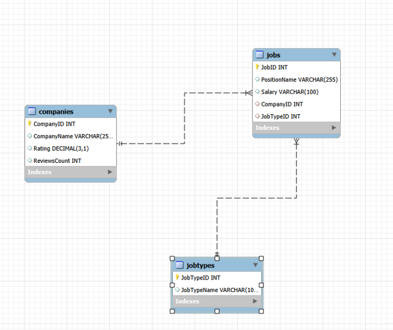

# Data Science Jobs Analysis Using SQL

## Project Overview

This project analyses a dataset of data science job vacancies using MySQL. The aim was to practise SQL by importing data, cleaning the dataset, creating a relational database, and answering questions about companies, job roles and employment types.

The project provided practical experience in designing a simple database, writing SQL queries and analysing real-world job market data.

## Dataset

The dataset contains information about data science job vacancies, including:

- Job title
- Company
- Salary
- Company rating
- Number of company reviews
- Employment type

## Database Design

To improve the database structure, the original dataset was divided into three related tables:

- **Companies** – stores company details, ratings and review counts.
- **Jobs** – stores job titles, salary information and links to companies and job types.
- **JobTypes** – stores different employment types, such as Full-time and Permanent.

This design reduces duplicated data and demonstrates the use of primary and foreign keys.


## Table Creation

The following SQL statement was used to create the `clean_jobs` table.

```CREATE TABLE clean_jobs AS
SELECT *
FROM data_science_jobs;```


## Database Schema

The project uses a simple relational database consisting of three tables: **Companies**, **Jobs**, and **JobTypes**. The tables are connected using foreign key relationships, allowing information to be retrieved using SQL joins.




## Example SQL Query

The following query calculates the average company rating.

```sql
SELECT ROUND(AVG(rating),2) AS AverageRating
FROM clean_jobs;
```

## Example SQL Query

The following query shows the companies with more than three job vacancies.

```sql
SELECT company,
       COUNT(*) AS Jobs
FROM clean_jobs
GROUP BY company
HAVING COUNT(*) > 3
ORDER BY Jobs DESC;
```

## Example SQL Query

The following query creates a view containing companies with a rating of 4.5 or higher.

```sql
CREATE VIEW High_Rated_Companies AS
SELECT *
FROM clean_jobs
WHERE rating >= 4.5;

SELECT *
FROM High_Rated_Companies;
```


## Data Cleaning

Before analysing the data, several cleaning steps were completed:

- Checked for missing values.
- Investigated duplicate records.
- Retained missing salary values because many job adverts did not include salary information.
- Checked for possible duplicate records. They were kept because they may represent different job adverts for the same role.

## SQL Skills Used

During this project, I used the following SQL concepts:

- CREATE DATABASE
- CREATE TABLE
- PRIMARY KEY
- FOREIGN KEY
- SELECT
- WHERE
- ORDER BY
- GROUP BY
- HAVING
- COUNT()
- AVG()
- MIN()
- MAX()
- INNER JOIN
- VIEWS

## Questions Answered

Some of the questions explored during the project include:

- Which companies advertise the most data science jobs?
- Which employment type is the most common?
- What is the average company rating?
- Which companies have the highest ratings?
- How many vacancies does each company advertise?
- Which jobs are available for each employment type?

## What I Learned

This project helped me improve my understanding of SQL and relational database design. I learned how to clean data before analysis, create relationships between tables using primary and foreign keys, and retrieve information from multiple tables using joins. It also gave me more confidence in using SQL to answer practical business questions.

## Conclusion

This project helped me gain practical experience using MySQL with a real-world dataset. 
It improved my understanding of database design, data cleaning and SQL queries. I also became more confident in analysing data using SQL.

## Source

Dataset: Data Science Jobs Dataset
Available from: Kaggle
